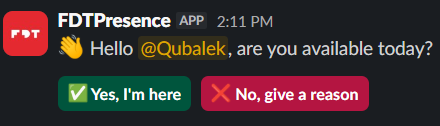
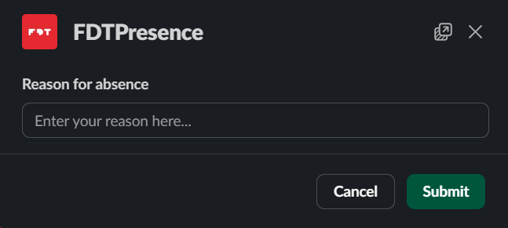
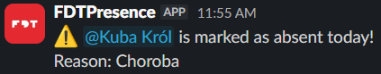

  

⭐ Below you will find a list of available commands, along with explanations of how they work and what responses they return. 🚀✨

---

## Daily Message

The bot sends a message to each external employee at a specified time, asking if they are available today.

  

## Absent

When the “No” button is clicked, a modal opens prompting the employee to provide a reason for their unavailability.

  

After the response is submitted, the data is automatically recorded in Google Sheets, and a notification message is sent to the project manager.

  

## Present

After clicking the “Yes” button, the employee’s availability is recorded in Google Sheets.

  

## No Response

If the employee does not respond within an hour, their status is marked as “No Response” in Google Sheets, and a notification is sent to the project manager. 

  

